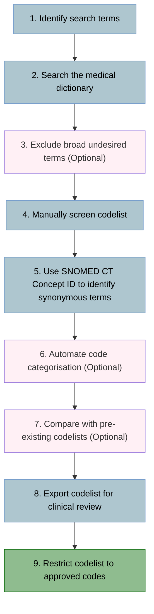

# How to: create SNOMED CT codelists for primary care electronic healthcare records

This is an extension of [current standard practice for primary care codelist creation](http://dx.doi.org/10.1136/bmjopen-2017-019637) which adds additional steps to take advantage of automated searches and advanced features of the SNOMED CT medical terminology to create more comprehensive codelists.

Creating SNOMED CT codelists can be broken down in to 9 steps:


1. **Identify search terms.**
    - To begin, you need to identify all terms and synonyms related to your clinical event of interest.
    - Next you need to create "search terms" to find each of these terms, making use of wildcard characters (*) to account for spelling variations, capitalisation, hyphenation, and other grammatical variations.
        - For example, to search for vaccines you may use the search terms: “\*vaccin\*”, “\*immunis\*”, and “\*immuniz\*”.

2. **Search the medical terminology dictionary using the search terms.**
    - Import the medical dictionary that includes the SNOMED CT term descriptions along with their Description ID and Concept ID.
    - Search the dictionary for each of your search terms defined in **Step 1**, ensuring that the dictionary terms are passed through a `lower()` function to avoid missing matches due to differing case.
    - Once you have searched the dictionary for all your terms, keep only the SNOMED CT terms that matched with at least 1 of your search terms.

3. **(OPTIONAL) Perform a secondary search to exclude broad undesired terms.**
    - There is a good chance that your search terms will also identify terms that are irrelevant to your clinical event of interest.
    - If there are a lot of irrelevant terms detected by the search terms defined in **Step 1**, you can perform another search on the included terms using *exclusion* search terms. This will highlight terms that should be removed from the current list.
    - Before removing any terms highlighted for exclusion, make sure any desired terms are not erroneously highlighted.
    - If the list of terms found after completing **Step 2** is short, you can skip straight to **Step 4**.

4. **Manual screen of codelist to remove undesired terms.**
    - It is important to complete a final manual screen of the codelist generated by your searches and manually remove any undesired codes using their Description ID (or medcodeid if using CPRD Aurum).

5. **Use the SNOMED CT Concept ID to find additional synonymous terms.**
    - SNOMED CT uses a Concept ID to refer to a single clinical concept that may have multiple terms associated with it.
        - For example, the medical concept of "myocardial infarction" has the synonyms "heart attack" and "infarction of heart". While these all have different Description IDs, they all have the same Concept ID.
    - Therefore we can use the Concept IDs of our current codelist to find further synonyms to add.
    - After adding the additional terms, check that they are appropriate. If they are not, consider whether the other terms associated with that concept are also appropriate. If the original terms are appropriate but the new terms are not, discard the newly found terms.

6. **(OPTIONAL) Use another search to automate the categorisation of codes.**
    - It is possible that you may want to categorise the codes you are searching for.
        - For example, if you are searching for smoking status codes, you may want to further classify the codes to identify current smoking, ex smoking, or never smoking.
    - If you repeat further searches for each of your desired categories (e.g., one for current smoking, one for ex smoking, and one for never smoking), you can further automate the production of your codelist.

7. **Export codelist for review by a primary care clinician.**
    - Export your codelist as an Excel spreadsheet (making sure SNOMED CT codes are stored as text rather than numbers).
    - Ask a clinician with primary care experience to review your codelist and check that the codes are appropriate to identify your clinical event of interest.
    - Ask the reviewing clinican to generate a column at the end of the spreadsheet headed with their initials where they label the list of terms with a 0 or 1 to classify terms that they would exclude (0) or include (1).

8. **Restrict your codelist to codes approved by a primary care clinician and save.**
    - Remove any codes from the codelist that were marked with a 0 by the reviewing clinican in **Step 7**.
    - Save your finished codelist and export it.
    - Your codelist is now ready to use!

## Example *Stata* code

This example code is a smoking codelist for *CPRD Aurum*, however the code could be applied to any database using SNOMED CT codes if the `medcodeid` variable is replaced with the SNOMED CT Description ID variable. The do file can be found [here](/scripts/stata/smoking_status.do).
```stata
//==============================================================================
// 2022-11-24 PWS codelist creation template (based on previous JKQ group 
// codelist templates)
//
// SMOKING STATUS
//
// Lines with 2 asterisks (**) at the beginning and end require modification
// Lines with 1 asterisk (*) at the beginning and end MAY require modification
//==============================================================================


// Initialise do file & import CPRD Aurum medical dictionary
//===========================================================

clear all
set more off

//**Working directory - where you will open/save files**
cd "D:\GitHub\code_lists\21_Health_Status_and_Health_Services\Smoking\CPRD_Aurum"

//**Enter name of do file here. This ensures all files have the same name.**
local filename "smoking_status"


//Open log file
capture log close
log using `filename', text replace


//*Directory of medical dictionary*
local browser_dir "Z:\Database guidelines and info\CPRD\CPRD_CodeBrowser_202105_Aurum"

//*Directory of label lookups*
local lookup_dir "Z:\Database guidelines and info\CPRD\CPRD_Latest_Lookups_Linkages_Denominators\Aurum_Lookups_May_2021"


//Import latest medical browser; force medcodeid, SNOMED CT Description ID, and SNOMED CT Concept ID to be string
import delimited "`browser_dir'/202105_EMISMedicalDictionary.txt", stringcols(1 5 6)

//Drop (currently) unused variables
drop release

//Label EMIS code category - REQUIRES CPRDLABEL ADO FILE
capture noisily cprdlabel emiscodecategoryid, lookup(EMISCodeCat) location(`lookup_dir')

//Check if cprdlabel is installed
if _rc == 199 {
	
	display in red "cprdlabel command needs to be installed. Install from: https://github.com/pstone22/cprdlabel"
}
else if _rc {

	error _rc
}

//Save medical code browser to a tempfile
tempfile medical
save `medical'


// STEP 1. IDENTIFY SEARCH TERMS
//===============================

//**Define search terms below. Use multiple local macros if categorising desired codes in to multiple categories make more sense**

local smokingstatus " "*smok*" "*cigar*" "*tobac*" "


// STEP 2. SEARCH THE MEDICAL TERMINOLOGY DICTIONARY USING THE SEARCH TERMS
//==========================================================================

//**Add any additional local macros if you have used more than 1**
//For each specified local macro...
foreach termgroup in /**/smokingstatus/**/ {
	
	//Generate an empty binary indicator variable taking the name of the local macro
	gen byte `termgroup' = .
	
	//For each SNOMED CT term description (converted to lower case)...
	foreach codeterm in lower(term) {
		
		//For each individual search term in the local macro
		foreach searchterm in ``termgroup'' {
			
			//Set the indicator variable to 1 if the SNOMED CT term description matches the search term from the local macro
			replace `termgroup' = 1 if strmatch(`codeterm', "`searchterm'")
		}
	}
}

keep if /**/smokingstatus/**/ == 1
compress

gsort /**/smokingstatus/**/ snomedctconceptid snomedctdescriptionid originalreadcode

tab1 /**/smokingstatus/**/


// (OPTIONAL) STEP 3. PERFORM A SECONDARY SEARCH TO EXCLUDE BROAD UNDESIRED TERMS
//================================================================================

//Comment out this section if not required.

//**Exclusion terms**

local exclude " "*accident*" "*allergen*" "*asthma*" "*burn*" "*diesel*" "*leaf*specific*" "*lighter*" "*virus*group*" "*waste*management*" "*wheeze*" "*socio-economic*" "*assist-lite*" "

local animal " "*cheese*" "*cockroach*" "*fish*" "*frog*" "*haddock*" "*mackerel*" "*rabbit*" "*salmon*" "*smoked*cod*" "*smoky*gilled*woodlover*" "*smoky*madtom*" "*trout*" "

local bacteria " "*bacill*" "*bacter*" "

local fire " "*conflagration*" "*fire*" "*smoke*alarm*" "*smoke*inhalation*" "

local garments " "*garment*" "*sigvaris*" "

local occupation " "*blender*" "*grader*" "*industry*" "*maker*" "*operator*" "*preparer*" "*processor*" "*stripper*" "*tobacconist*" "


//Search for codes to exclude
foreach excludeterm in exclude /**/animal bacteria fire garments occupation/**/ {

	gen byte `excludeterm' = .

	foreach codeterm in lower(term) {
		
		foreach searchterm in ``excludeterm'' {		
			
			replace `excludeterm' = 1 if strmatch(`codeterm', "`searchterm'")
		}
	}
}

//Check that nothing important is highlighted for exclusion before dropping
list term if exclude == 1
/**/list term if animal == 1
list term if bacteria == 1
list term if fire == 1
list term if garments == 1
list term if occupation == 1/**/

drop if exclude == 1 ///
/**/	| animal == 1 ///
		| bacteria == 1 ///
		| fire == 1 ///
		| garments == 1 ///
		| occupation == 1/**/

drop exclude /**/animal bacteria fire garments occupation/**/
count
compress


// STEP 4. MANUAL SCREEN OF CODELIST TO REMOVE UNDESIRED TERMS
//=============================================================

//**medcodeids to remove**
local initial_remove "1834611000006117 8285811000006114 4153251000006115  8285791000006110 9211501000006113 8285721000006113 6542461000006112 2703821000006119 8285781000006112 5172291000006114 11930621000006114 1865641000006112 8285801000006111 1856551000006114 2866001000006114"

gen byte remove = 0

foreach medcode of local initial_remove {
	
	replace remove = 1 if medcodeid == "`medcode'"
}

list medcodeid snomedctdescriptionid snomedctconceptid originalreadcode term if remove == 1
drop if remove == 1
drop remove

compress
tab1 /**/smokingstatus/**/


// STEP 5. USE THE SNOMED CT CONCEPT ID TO FIND ADDITIONAL SYNONYMOUS TERMS
//==========================================================================

//Check for missing SNOMED CT Concepts
codebook snomedctconceptid
assert !missing(snomedctconceptid)

count

//Make a note of current list
preserve

keep medcodeid /**/smokingstatus/**/
gen byte original = 1
tempfile original
save `original'

restore

//Merge SNOMED CT Concepts with medical dictionary
keep snomedctconceptid /**/smokingstatus/**/
bysort snomedctconceptid: keep if _n == 1

merge 1:m snomedctconceptid using `medical', nogenerate keep(match)
merge 1:1 medcodeid using `original', nogenerate
compress
order snomedctconceptid, before(snomedctdescriptionid)
order /**/smokingstatus/**/, last
gsort /**/smokingstatus/**/ originalreadcode


count

//Show new codes
foreach category of varlist /**/smokingstatus/**/ {
	
	display "New terms found for: `category'"
	list snomedctconceptid originalreadcode term if original != 1 & `category' == 1
}

//Check new codes in the context of originally included SNOMED CT Concept ID codes
preserve

drop if original == 1
keep snomedctconceptid
bysort snomedctconceptid: keep if _n == 1

count
local obs = r(N)

forvalues i = 1/`obs' {
	
	if `i' == 1 {
		
		local expanded_ids = snomedctconceptid in `i'
	}
	else {
		
		local expanded_ids = "`expanded_ids' " + snomedctconceptid in `i'
	}
}

restore

foreach expanded_id of local expanded_ids {
	
	display "SNOMED CT Concept ID for which additional terms where found: `expanded_id'"
	
	list medcodeid originalreadcode term if snomedctconceptid == "`expanded_id'"
}


// (OPTIONAL) STEP 6. USE ANOTHER SEARCH TO AUTOMATE THE CATEGORISATION OF CODES
//===============================================================================

//Comment out this section if not required.

//**Search terms for each categorisation desired**

local current " "*current*" "*smokes*" "*smoker*" "*smoking*" "*refer*" "*cessation*" "*stop*smoking*" "*cigarette*" "*tobacco*" "*assessment*" "*advice*" "*trying*" "*restart*" "*increase*" "*education*" "*poisoning*" "*nicotine*" "

local ex " "*ex *" "*ex-*" "*past*smoker*" "*abstinent*" "*current*non-*" "*current*non *" "*stopped*" "*age*cessation*" "*ceased*" "*carbon*monoxide*non*" "*smoked*" "*withdrawal*" "*smoker*before*" "*history*of*smok*" "

local never " "*never*" "*non*smok*" "*does*not*" "

local smokeless_tobacco " "*snuff*" "*chew*" "*moist*" "*powdered*" "*smokeless*" "

local unknown " "*refusal*to*" "*declined*to*" "*smoking*status*" "*pack*years*" "age*" "* age*"  "*weeks*" "*amount*" "*habits*" "*time*since*" "*consumption*" "*total*" "*tobacco*use" "*smoking*behaviour*" "

local passive " "*passive*" "*second*hand*" "*household*" "*parent*" "*carer*" "*mother*" "*father*" "*family*" "*in*public*" "*expos*smoke*" "*smoke*exposure*" "*smokefree*home*" "*smoker*home*" "*involuntary*" "*secondary*exposure*" "*child*exam*" "

local vape " "*vape*" "*electronic*" "e-*" "* e-*" "

local drugs " "*heroin*" "*cannabis*" "*methadone*" "*diamorphine*" "*impregnate*" "*dragon*" "*smokes*drugs*" "


//Search for codes
foreach excludeterm in /**/drugs passive vape smokeless_tobacco ex never unknown current/**/ {

	gen byte `excludeterm' = .

	foreach codeterm in lower(term) {
		
		foreach searchterm in ``excludeterm'' {		
			
			replace `excludeterm' = 1 if strmatch(`codeterm', "`searchterm'")
		}
	}
}

gsort /**/drugs passive vape smokeless_tobacco ex never unknown current/**/

//**Create and label variable for smoking status**
label define smoking_status 1 "Never smoker" 2 "Ex-smoker" 3 "Current smoker"
gen smoking_status = .
label values smoking_status smoking_status

replace smoking_status = 3 if current == 1
replace smoking_status = 1 if never == 1
replace smoking_status = 2 if ex == 1
replace smoking_status = . if unknown == 1 ///
							| drugs == 1 ///
							| passive == 1 ///
							| vape == 1 ///
							| smokeless_tobacco == 1


//**Categorisation corrections (using SNOMED CT Concept IDs)**

//Should be "Never"

local never "266919005 221000119102"

foreach code of local never {
	
	list medcodeid snomedctconceptid snomedctdescriptionid originalreadcode term if snomedctconceptid == "`code'"
	
	replace smoking_status = 1 if snomedctconceptid == "`code'"
}


//Should be "Ex"

local ex "160618006 395177003 8517006 1221000119103 1092511000000105 904221000006106 1626121000006100 1873511000006102 904091000006100 191889006 191889006 201931000000109 710081004 37311000006101 904201000006101 201941000000100 440012000 85931000119105 852121000006105 909391000006101 713700008 1974571000006100 1221000175102 137761000006105 228486009 1092031000000108 266928006 384742004"

foreach code of local ex {
	
	list medcodeid snomedctconceptid snomedctdescriptionid originalreadcode term if snomedctconceptid == "`code'"
	
	replace smoking_status = 2 if snomedctconceptid == "`code'"
}


//Should be "Current"

local current "10761391000119102 266918002 228487000 230057008 1974421000006100 230058003 857871000000107 89765005 413173009 470041000000100 191887008 470041000000100 266927001 724697004 160613002 1421000175103 697956009 722497008 314538009 30483005 57264008 711028002 365982000 110483000 230056004 405140009 143461000000103 1110971000000101"

foreach code of local current {
	
	list medcodeid snomedctconceptid snomedctdescriptionid originalreadcode term if snomedctconceptid == "`code'"
	
	replace smoking_status = 3 if snomedctconceptid == "`code'"
}


//Should be "Value" - i.e. manually entered value

local value "1746211000006107 390902009 766931000000106 390904005 137811000006103 390903004"

foreach code of local value {
	
	list medcodeid snomedctconceptid snomedctdescriptionid originalreadcode term if snomedctconceptid == "`code'"
	
	replace smoking_status = . if snomedctconceptid == "`code'"
}


//Too vague to be classified
replace smoking_status = . if strmatch(lower(term), "*follow*up*")
replace smoking_status = . if strmatch(lower(term), "*f/u*")
replace smoking_status = . if strmatch(lower(term), "*monitor*")

local vague "365980008 365981007 108333003 904051000006106 904211000006103 171209009 102408007 717761000000101 716391000000109 999000891000000102 229819007 1833971000006100 16581000006107 408398007 720201000000102 102407002 717771000000108 390900001 698289004 904191000006104 714021000000104 751661000000106 1431000175100 852131000006108 228487000 1873511000006102 374361000000100 750851000000104"

foreach code of local vague {
	
	list medcodeid snomedctconceptid snomedctdescriptionid originalreadcode term if snomedctconceptid == "`code'"
	
	replace smoking_status = . if snomedctconceptid == "`code'"
}


//Remove from list completely
local remove "83086008 421693007 75856009 37921004 27743007 45349003 465409000 82958007 30795006 855801000006100"

foreach code of local remove {
	
	list medcodeid snomedctconceptid snomedctdescriptionid originalreadcode term if snomedctconceptid == "`code'"
	
	drop if snomedctconceptid == "`code'"
}


//Passive smoking - Unexposed & codes to remove
replace passive = . if smoking_status != .  //already classified

label define passive 0 "Unexposed" 1 "Exposed"
label values passive passive

local unexposed "1899561000006105 1899581000006100 438618001 1911921000006104 1888821000006108 394885002 315213009 448755007 394964001 711563001 443847005"

foreach code of local unexposed {
	
	list medcodeid snomedctconceptid snomedctdescriptionid originalreadcode term if snomedctconceptid == "`code'"
	
	replace passive = 0 if snomedctconceptid == "`code'"
}


local passive_remove "1104251000000106 1899541000006106 1033041000000104 1934421000006103"

foreach code of local passive_remove {
	
	list medcodeid snomedctconceptid snomedctdescriptionid originalreadcode term if snomedctconceptid == "`code'"
	
	drop if snomedctconceptid == "`code'"
}


//Vaping - Current & Ex
label define vape 0 "Never vaper" 1 "Ex-vaper" 2 "Current vaper"
label values vape vape

recode vape 1=2  //make all tagged values Current vapers

local ex_vape "908781000000104"  //values to make Ex

foreach code of local ex_vape {
	
	list medcodeid snomedctconceptid snomedctdescriptionid originalreadcode term if snomedctconceptid == "`code'"
	
	replace vape = 1 if snomedctconceptid == "`code'"
}


//Smokeless tobacco - Current, Ex, Never, & codes to exclude
label define smokeless 0 "Never smokeless tobacco" 1 "Ex smokeless tobacco" 2 "Current smokeless tobacco"
label values smokeless_tobacco smokeless

recode smokeless_tobacco 1=2

local ex_smokeless "228506009 228520002 228503001 228513009 1599721000006109 735112005"
local never_smokeless "228502006 228512004 228511006 228501004"
local remove_smokeless "228499007 363906001 228509002 363907005"

foreach code of local ex_smokeless {
	
	list medcodeid snomedctconceptid snomedctdescriptionid originalreadcode term if snomedctconceptid == "`code'"
	
	replace smokeless_tobacco = 1 if snomedctconceptid == "`code'"
}

foreach code of local never_smokeless {
	
	list medcodeid snomedctconceptid snomedctdescriptionid originalreadcode term if snomedctconceptid == "`code'"
	
	replace smokeless_tobacco = 0 if snomedctconceptid == "`code'"
}

foreach code of local remove_smokeless {
	
	list medcodeid snomedctconceptid snomedctdescriptionid originalreadcode term if snomedctconceptid == "`code'"
	
	drop if snomedctconceptid == "`code'"
}


//Final removal of codes that cannot be categorised
local final_remove "108333003 836001000000109 1809121000006109 427189007 169940006 698289004 12465801000001106 720201000000102 1538681000006102"

foreach code of local final_remove {
	
	list medcodeid snomedctconceptid snomedctdescriptionid originalreadcode term if snomedctconceptid == "`code'"
	
	drop if snomedctconceptid == "`code'"
}


//Tidy up and generate variables for all desired categories
gsort smoking_status drugs passive vape smokeless_tobacco unknown
drop original current ex never unknown


generate gp_recorded_smoking = 1 if smoking_status != . ///
	| (drugs == . & passive == . & vape == . & smokeless_tobacco == .)

generate ever_smoker = 1 if smoking_status == 2 | smoking_status == 3


order term smoking_status, after(emiscodecategoryid)


// STEP 7. EXPORT CODELIST FOR REVIEW BY A PRIMARY CARE CLINICIAN
//================================================================

gsort /**/smoking_status drugs passive vape smokeless_tobacco/**/ snomedctconceptid snomedctdescriptionid originalreadcode
compress
save `filename', replace
export excel `filename'.xlsx, firstrow(variables) replace
export delimited `filename'.csv, quote replace


// STEP 8. RESTRICT YOUR CODELIST TO CODES APPROVED BY A PRIMARY CARE CLINICIAN AND SAVE
//=======================================================================================

//This codelist was updated with clinican input as it was created.
//Therefore I have just compared with the previous codelist.

//Load JKQ classifications
/*
import excel `filename'_JKQ, firstrow case(lower) clear

keep medcodeid jkq

tempfile jkq_classification
save `jkq_classification'

use `filename', clear

merge 1:1 medcodeid using `jkq_classification', nogenerate

//Remove codes marked for exclusion by JKQ
list medcodeid snomedctconceptid term if jkq == 0
drop if jkq == 0

//Save JKQ approved codelist
gsort snomedctconceptid snomedctdescriptionid originalreadcode
compress
save `filename', replace
export delimited `filename', replace quote
export excel "`filename'.xlsx", replace firstrow(var)
*/

//Compare with previous codelist
preserve

merge 1:1 medcodeid using smoking

gsort smoking_status drugs passive vape smokeless_tobacco gp_recorded_smoking

list term smoking_status drugs passive gp_recorded_smoking smokstatus if _merge > 1

restore


// STEP 9. GENERATE TAG FILE
//===========================

//=**Update details here, everything else is automated**========================
local description "Smoking status"
local author "Phil"
local date "August 2022"
local code_type "SNOMED CT"
local database "CPRD Aurum"
local database_version "May 2021"
local keywords "smoking status, tobacco smoking, drug smoking, passive smoking, vaping, smokeless tobacco, GP recording of smoking, ever smoker"
local notes "Provides variables for smoking status (current/ex/never), drug smoking, passive smoking (exposed/unexposed), vaping (current/ex), smokless tobacco (current/ex/never), GP record of smoking (not useful for determining smoking status but may be useful for assessing GP performance), and ever smoker (patients labelled as current or ex)"
local date_JKQ_approved "August 2022"
//==============================================================================

clear
gen v1 = ""
set obs 9

replace v1 = "`description'" in 1
replace v1 = "`author'" in 2
replace v1 = "`date'" in 3
replace v1 = "`code_type'" in 4
replace v1 = "`database'" in 5
replace v1 = "`database_version'" in 6
replace v1 = "`keywords'" in 7
replace v1 = "`notes'" in 8
replace v1 = "`date_JKQ_approved'" in 9

export delimited "`filename'.tag", replace novarnames delimiter(tab)


use "`filename'", clear  //So that you can see results of search after do file run


log close
```

## Example *R* code
An example smoking status R script can be found [here](scripts/R/smoking_status.R).

## Example *python* code
An example smoking status python script can be found [here](scripts/python/smoking_status.py) (work in progress).
